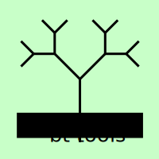

  

# bt_tools

Tools to view behavior trees:

- [btlib](btlib/): Library to parse behavior trees.
- [bt_view](bt_view/): Tools to visualize behavior tree runs.
- [rqt_bt_live](rqt_bt_live/): Tool to view behavior trees in rqt at runtime.

## Contribution Guidelines

See [Contributing](./CONTRIBUTING.md).

## Feedback

Feedback is highly appreciated. Please open issues on new ideas, bugs, etc. here at [bt_tools/issues](https://github.com/boschresearch/bt_tools/issues) or reach out to the maintainers.

## About

### Maintainers

- [Christian Henkel](https://github.com/ct2034)

### Contributors

... are welcome at any time and will be listed here. We thank [Robert Schirmer](https://www.linkedin.com/in/robertschirmer/) for the valuable input and discussions about the design of bt_tools.

### 3rd Party Licenses

Currently, bt_tools does not come with any 3rd-party components/modules. Note that bt_tools highly depends on ROS 2, which largely comes under the permissive licenses Apache 2.0 and 3-clause BSD.

### License

bt_tools comes under the Apache-2.0 license, see [LICENSE](./LICENSE).
