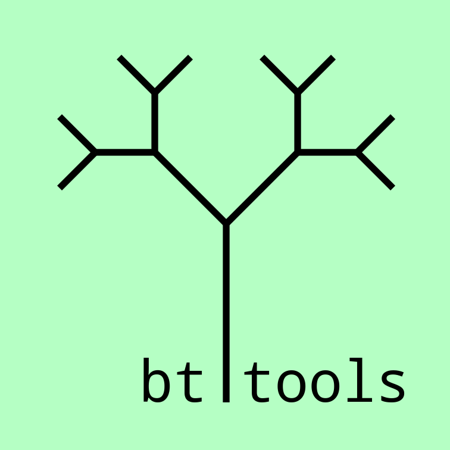
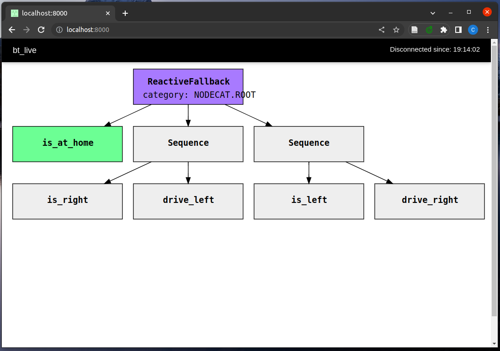
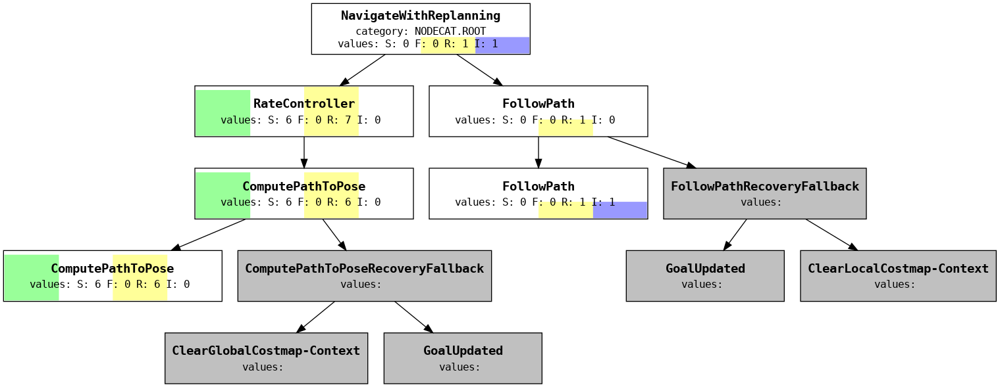

# bt_tools

[](https://github.com/boschresearch/bt_tools/actions/workflows/industrial_ci.yml)
[](https://github.com/boschresearch/bt_tools/actions/workflows/lint.yaml)
[](https://bt-tools.readthedocs.io/en/latest/)
[](https://github.com/boschresearch/bt_tools/issues)
[](https://github.com/boschresearch/bt_tools/pulls)
[](https://github.com/boschresearch/bt_tools/search?l=python)
[](https://github.com/boschresearch/bt_tools/blob/main/LICENSE)



__bt_tools__ is a collection of software for working with behavior trees (BTs) in ROS. It contains means for interpreting, visualizing and introspecting BTs.


## btlib

A Library to parse behavior trees.

### How to generate fbl files

To analyze past runs of a behavior tree, you need to enable the logging to fbl files. This is a feature of the BehaviorTree.CPP library but for example navigation2 does currently not support it.
You can enable the support like this: <https://github.com/ct2034/navigation2/commit/b019fbc49d72dd34a45128bb20d1114e9b8c2b24>

## bt_live

Look at the behavior tree at runtime

### Usage

The tool currently requires an `fbl` log file, because it contains the tree definition.
But it will then visualize the tree at runtime based on the messages published unter `/behavior_tree_log`.

```bash
ros2 run bt_live bt_live --ros-args -p fbl_file:=<path_to_fbl_log>
```

Then open a browser at <http://localhost:8000> to see the visualization.
It should look a little something like this:



## bt_view

Tools to visualize and analyze past behavior tree runs.

### Visualizing a `fbl` log

```bash
ros2 run bt_view bt_view --bt_log_fbl_fnames <path_to_fbl_log>
```

The tool will output images about

- the count of calls with the suffix `_count.png` and
- the return states with the suffix `_states.png`
to the same folder that the `fbl` log is in.

For example, the `_states.png` file will look like this:



### Calculate coverage

```bash
ros2 run bt_view bt_view --bt_log_fbl_fnames <path_to_fbl_log> --coverage-threshold <threshold>
```

The tool will count the percentage of nodes that have been executed in the giben fbl file(s). Iff above the threshold, it will return 0.

# Contributing

## Contribution Guidelines

See [Contributing](./CONTRIBUTING.md).

## Feedback

Feedback is highly appreciated. Please open issues on new ideas, bugs, etc. here at [bt_tools/issues](https://github.com/boschresearch/bt_tools/issues) or reach out to the maintainers.

## About

### Presentations

- [ROSCon 2023](https://roscon.ros.org/2023/): Supporting Robotic Deliberation: The Deliberation Working Group and Tools for Behavior Trees
    - [Video](https://vimeo.com/879001877/4978646728)
    - [Slides](https://roscon.ros.org/talks/Supporting_Robotic_Deliberation_The_Deliberation_Working_Group_and_Tools_for_Behavior_Trees.pdf)

### Maintainers

- [Christian Henkel](https://github.com/ct2034)

### Contributors

... are welcome at any time and will be listed here. We thank [Robert Schirmer](https://www.linkedin.com/in/robertschirmer/) for the valuable input and discussions about the design of bt_tools.

### 3rd Party Licenses

Currently, bt_tools does not come with any 3rd-party components/modules. Note that bt_tools highly depends on ROS 2, which largely comes under the permissive licenses Apache 2.0 and 3-clause BSD.

### License

bt_tools comes under the Apache-2.0 license, see [LICENSE](./LICENSE).
